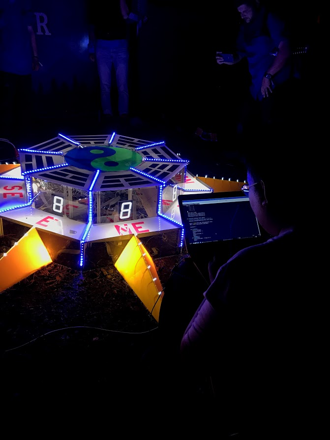
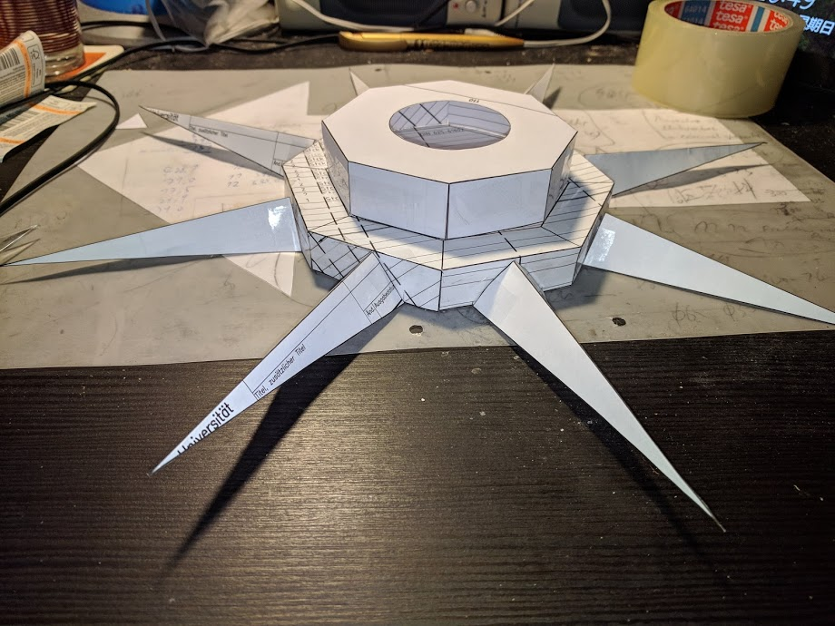
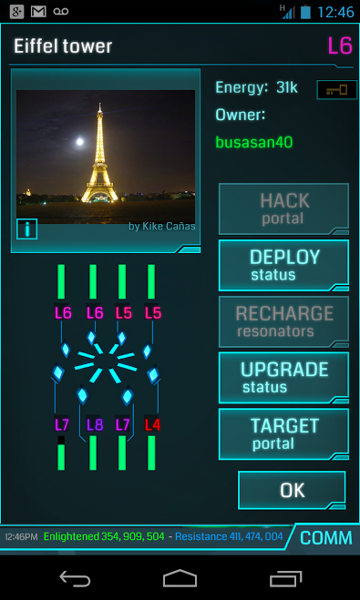
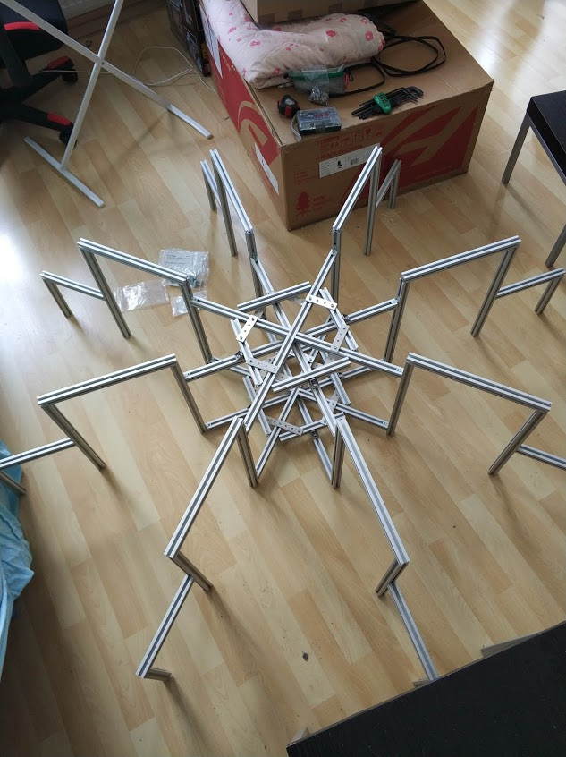
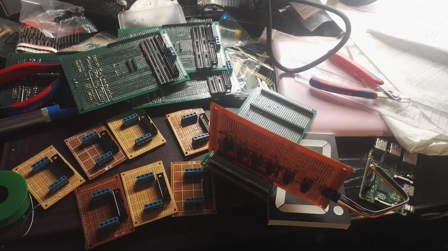
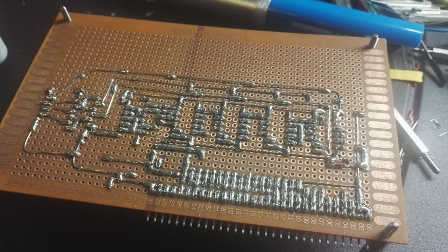
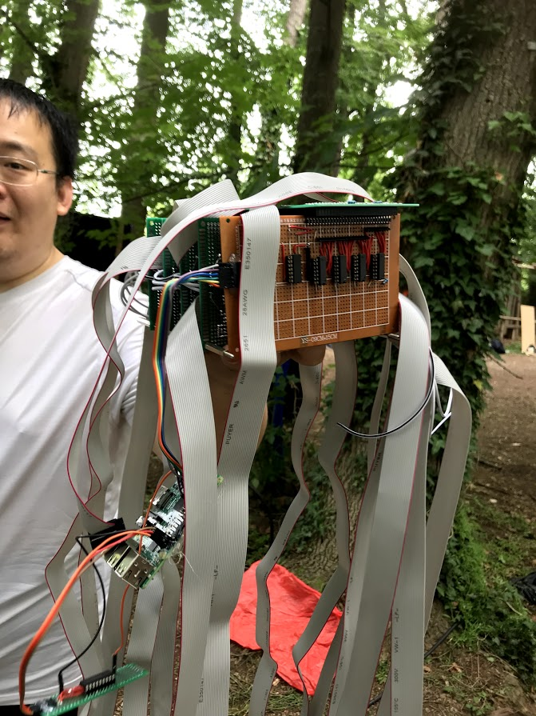
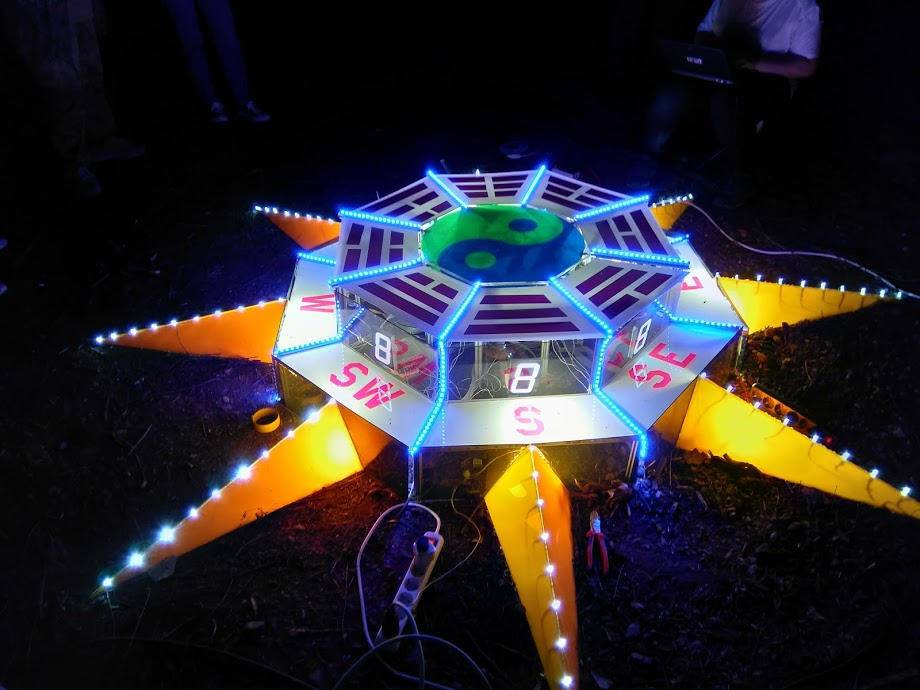
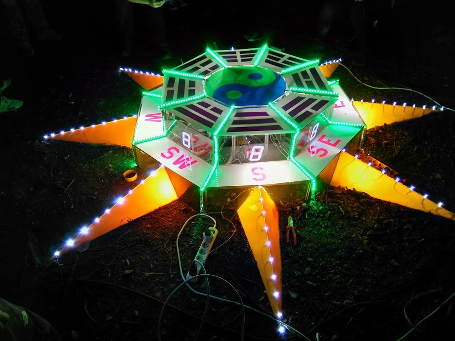

These unforgettable nights were between 25th and 27th of May 2018, at
[Schloss Kaltenberg](https://goo.gl/maps/59Va2d5UkukSWRWNA).

We, as a team of Chinese speaking "agents" (a name for
[Ingress](https://ingress.com/) players), joined this event as a team
(representing the archetype "trickster"), designed and built a beautiful
physical portal named "Afflatus Octet". In this personal page, I will try to
review some technical designs behind those acrylic surfaces :)

## 1. Aim of Design

Aim of the design is doing a lighting artwork. Details of this artwork leaves
to each team, but they should all represent the status of a few "portals". In
Ingress, a portal is an in-game virtual object, but have a corresponding
geolocation where a real thing like a sculpture, an artwork, a place with
historical evidence, etc. exists.

With mobile phones running Ingress, portals can be interacted by players
physically nearby. Interactions within the game, like capturing (aligning the
portal to player's faction), upgrading (installing one or more resonators),
changes a portal's status. In Kaltenberg, Niantic wants all participating teams
visualize these status via technical methods, mostly by lights, and in an
artistic way.

## 2. Artistic Sketch

After I and a group of players applied successfully in this event, we began
working immediately on its design. Player @dasKupfer sketched the whole idea,
based on Chinese philosophy "Pa Kua", and @StormAndre did a quick paper model,
as a preview:

An Ingress portal have 8 slots for resonators (an in-game item), and an
alignment to either green ("Enlightened") or blue ("Resistance") faction. Each
resonator has an item level and a charge level.

Above is a screenshot when examing a portal in Ingress 1.0. It's owner is
Enlightened (green), so the portal is green. All of its 8 slots are installed
with resonators, where the Level-7 one bottom left having ~75% charge level in
comparsion to others fullly charged.

All such attributes will be utilized for our artwork:

1. The whole appartus will be colored with light strips, which changes color
between white, blue and green for alignments.
2. For each one of all 8 sides, a numercial display is used to show the level
for a resonator. If no resonator is installed, that display is disabled.
3. On each ace, there will be 10 LEDs installed, showing the charge level like
a progress bar.

## 3. Mechanical Structure

It's now to figure out how to build up the whole octal shape. At beginning
@StormAndre suggested to use wood, which we thought would be too bulky,
expensive and difficult for transport (we were required to transport and remove
all our materials to Kaltenberg).

The final decision was an aluminium structure using 20x20 profiles. I drew the
whole structure on AutoCAD, determined the measurements, and @swdta handled
most purchases and deliveries.

Following was this structure, a few days before event and assembled at @swdta's
home for test.

## 4. Electrical Structure

This was the most complex part. The purpose is to control:

1. 8x10 LEDs, for resonator charge level;
2. 8x8-segment numerical displays, for resonator item level;
3. a switch system for light strips, between 3 colors;

In total, there are 147 IO ports needed to be controlled individually. Despite
for light strips, for each one of the eight sides, 18 bits are needed. Having
no enough MCU boards at hand, I decided with a circuit with logic gates:

1. For each 18 bits, a 24-bit latch (3x74HC573) followed by 3xULN2003 are used
to drive the lamps.
2. Latches are fed using a parallel bus, and the highest bits used for
addressing one of the 8 sides. 
3. A 3-bit AND gate is installed for each side for decoding addresses.
4. The parallel bus is filled using 4x74LS164 8-bit parallel-out serial shift
registers. So that only several GPIOs from Raspberry PI are required to operate
the whole system.

It's later shown that this structure, although simple to understand, was hard
to implement manually. The choice of using parallel bus increased whole amount
of work dramatically.

Backside of shift register / parallel bus feeder:

And the total system, after removed from its core:

## 5. But anyway...

It was beautiful in the night!

